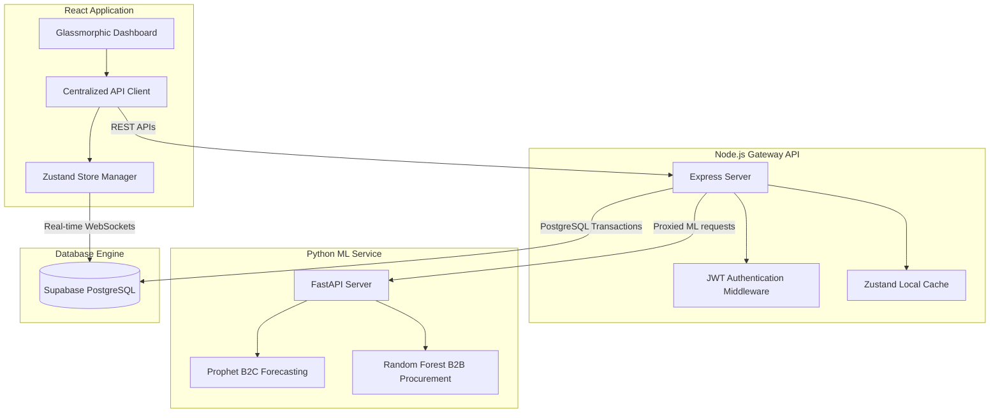

# IMS Predictive — Wholesaler B2B Inventory & Demand Forecasting System

IMS Predictive is a dual-sided web application designed to optimize B2B supply chains using machine learning. It provides real-time catalog syncing, concurrent transactional checkout with stock protection, and predictive analytics for demand planning and wholesaler procurement.

---

## 🏗️ System Architecture



---

## 🛠️ Technology Stack

*   **Frontend**: React (v19) + TypeScript + TailwindCSS + Zustand State Management.
*   **Core Gateway API**: Node.js + Express + TypeScript + Zod Payload Hardening + Helmet Security.
*   **Machine Learning Microservice**: Python (v3.10+) + FastAPI + Facebook Prophet (B2C demand curve time-series) + Scikit-Learn Random Forest Regressor (B2B wholesaler supply forecasting).
*   **Database & Real-time Synchronization**: Supabase (PostgreSQL) with row-level security (RLS) policies, transactional database functions (RPC), and real-time WebSocket replication.

---

## 🚀 Local Setup & Configuration

### Prerequisites
Ensure you have the following installed on your machine:
*   [Node.js](https://nodejs.org/) (v18+)
*   [Python](https://www.python.org/) (v3.10+)
*   [Supabase CLI](https://supabase.com/docs/guides/cli) (optional, or a Supabase cloud project)

---

### Step 1: Database Setup (Supabase)
1. Create a new project on [Supabase](https://supabase.com/).
2. Run the SQL schema script located at `supabase/migrations/20260701_initial_schema.sql` inside the Supabase SQL Editor to initialize tables, row-level security (RLS) policies, indexes, and transactional RPC functions.
3. Enable real-time updates for the `products` table in the database replication settings.

---

### Step 2: Node.js Express Backend Setup
1. Navigate to the gateway directory:
    ```bash
    cd backend-node
    ```
2. Install dependencies:
    ```bash
    npm install
    ```
3. Create a `.env` file from the `.env.example` template:
    ```env
    PORT=5000
    SUPABASE_URL=https://your-supabase-project.supabase.co
    SUPABASE_SERVICE_ROLE_KEY=your-supabase-service-role-key
    PYTHON_ML_SERVICE_URL=http://localhost:8000
    INTERNAL_SECRET_TOKEN=your-shared-secure-token
    FRONTEND_URL=http://localhost:5173
    ```
4. Start the development server:
    ```bash
    npm run dev
    ```

---

### Step 3: Python ML Microservice Setup
1. Navigate to the Python microservice directory:
    ```bash
    cd backend-python
    ```
2. Create and activate a Python virtual environment:
    ```bash
    python -m venv venv
    # Windows:
    .\venv\Scripts\activate
    # macOS/Linux:
    source venv/bin/activate
    ```
3. Install the dependencies listed in `requirements.txt`:
    ```bash
    pip install -r requirements.txt
    ```
4. Create a `.env` file based on `.env.example`:
    ```env
    INTERNAL_SECRET_TOKEN=your-shared-secure-token
    PORT=8000
    ```
5. Start the FastAPI server:
    ```bash
    python main.py
    ```

---

### Step 4: React Frontend Setup
1. Navigate to the frontend workspace:
    ```bash
    cd frontend
    ```
2. Install dependencies:
    ```bash
    npm install
    ```
3. Create a `.env` file based on `.env.example`:
    ```env
    VITE_SUPABASE_URL=https://your-supabase-project.supabase.co
    VITE_SUPABASE_ANON_KEY=your-supabase-anon-key
    VITE_API_URL=http://localhost:5000
    ```
4. Start the Vite React app:
    ```bash
    npm run dev
    ```

---

## 🧪 Running Unit Tests

Both the frontend and backend Node service contain fully integrated Unit Test suites via Vitest:

### Run Backend Validator Tests:
```bash
cd backend-node
npm test
```

### Run Frontend Store Tests:
```bash
cd frontend
npm test
```

---

## 📡 API Endpoint Reference

| Method | Endpoint | Description | Auth Required |
|---|---|---|---|
| **POST** | `/api/inventory/bulk` | Bulk upsert CSV items into catalog | JWT (Wholesaler) |
| **POST** | `/api/orders` | Process transaction and order checkout | JWT (Retailer) |
| **GET** | `/api/analytics/forecast` | Retrieve Prophet time-series customer demand forecasts | JWT (Retailer) |
| **PATCH** | `/api/orders/:id/status` | Update status (complete/cancel) for an order | JWT (Wholesaler) |
| **GET** | `/api/analytics/procurement` | Retrieve Random Forest B2B procurement advisor predictions | JWT (Wholesaler) |
| **GET** | `/health` | Gateway service status check | None |
